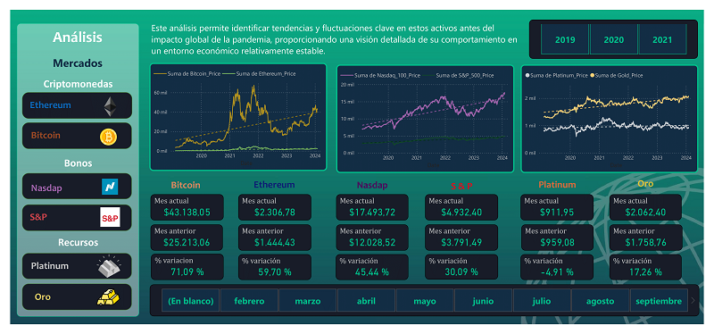

# <h1 align="center">_Analisis del Mercado Financiero Pandemia COVID-19 2019-2021_</h1>

  

## Índice

1. [Descripción](#descripción)
2. [Características del proyecto](#características-del-proyecto)
3. [Estructura del Proyecto](#estructura-del-proyecto)
4. [Enlaces](#enlaces)
5. [Vista Previa - Power BI](#vista-previa---power-bi)
6. [Colaboradores](#colaboradores)
7. [Tecnologías](#tecnologías)

## Descripción

Este proyecto tiene como objetivo realizar un analisis tecnico del mercado de valores para proporcionar insights sobre el comportamiento de este en las etapas pre-pandemia, pandemia, y pos-pandemia para conocer el impacto en diferentes comodites e industrias que cotizan en las principales bolsas de valores. Utilizando técnicas de análisis de datos y visualización para interpretar y comunicar los resultados.

## Características del Proyecto

1. **Análisis Técnico del Mercado de Valores**  
2. **Impacto de la Pandemia en Industrias y Commodities**  
3. **Estudio de las Etapas Pre-pandemia, Pandemia y Pos-pandemia**  
4. **Análisis de Mercados Financieros en las Principales Bolsas de Valores**  
5. **Técnicas de Análisis de Datos**  
6. **Interpretación y Comunicación de Resultados**  
7. **Visualización de Datos para Insights**  
8. **Evaluación de Comportamiento de Activos Financieros**  
9. **Comparación de Impacto en Diferentes Industrias**  
10. **Uso de Herramientas de Ciencia de Datos**

## Tecnologias

- **Python 3.x**
- **Pandas**
- **Matplotlib**
- **Pyplot**
- **Numpy**
- **Jupyter Notebook**
- **SKlearn**

## Estructura del Proyecto

- c20-66-m-data-bi/
- │
- ├── datos/                         # Directorio para los datos procesados y sin procesar.
- ├── imagenes/                      # Imagenes del readme.
- ├── Notebooks/                     # Jupyter Notebooks para análisis exploratorio y Machine Learning.
- ├── graficos/                      # Graficos en png.
- ├── README.md                      # Este archivo README.
- ├── Presentacion.pbix              # Presentación del proyecto.
- └── ...  

## Enlaces

1-[Presentación del Proyecto](https://www.canva.com/design/DAGPnk-R1dQ/X2Pm82CXx1zy51MjwVArpQ/view?utm_content=DAGPnk-R1dQ&utm_campaign=designshare&utm_medium=link&utm_source=editor)

2-[Dashboard Interactivo](https://app.powerbi.com/groups/me/reports/22ed2044-ee0b-4a25-b8b2-8d8d2a94e892/e719377014e91008882b?experience=power-bi)

3-[Archivo Power BI](https://www.transfernow.net/dl/c20-66-m-data-bi)

## Vista Previa - Power BI

  
  

## Colaboradores

|                         | Nombre   |   Rol                    | GitHub & LinkedIn                                                                                                                                                                                          |
| ----------------------------- | -------- | ---------------------- | ------------------------------------------------------------------------------------------------------------------------------------------------------------------------------------------------------- |
|  | Tomas Berni | Data Scientist and Machine Learning |                           |                        |
|                               |
|  | Nathaly Castro | Data Analytics |                           |
|                               |
|  | Santiago Nuñez | Data Engineer |                           |
|                               |

## Tecnologías

